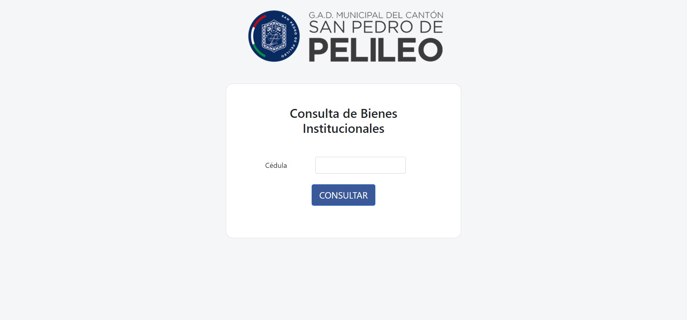
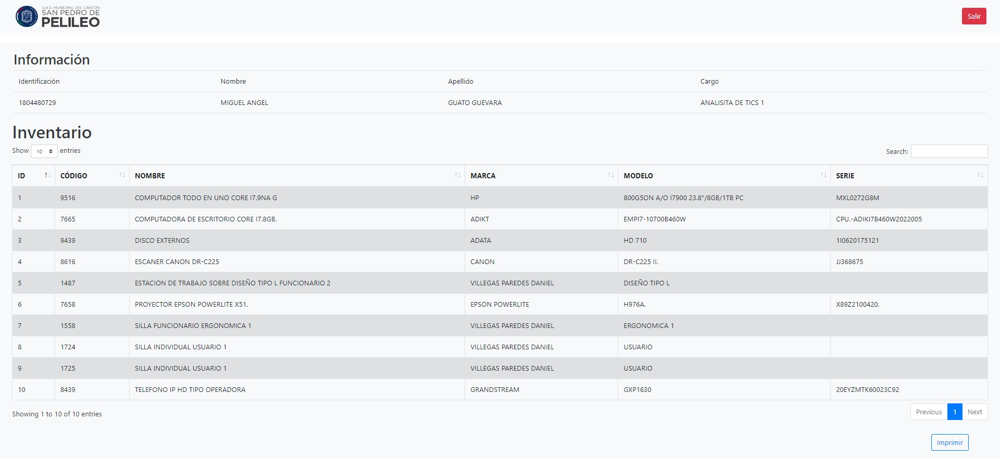

# Sistema para consulta de Bienes

 Software diseñado para facilitar la administración y supervisión de información relacionada con los estudiantes en una institución educativa

## Tecnologías utilizadas

- Java
- MySql

## Características

- Diseño moderno y receptivo.
- Listado de todos los estudiantes.
- Reporte de estudiantes

## Instalación y ejecución
Por el momento no se encuentra en host, pero se lo puede ejecutar de forma local con un servidor local para su visualización
- Pasos:
1. Clona o descarga este repositorio en tu máquina local.
2. Abre el proyecto en tu editor texto preferido (NetBeans).
4. Ejecuta con F5.

## Personalización

Si deseas personalizar este sitio web para tu propio uso debes tener conocimiento en java, sigue estos pasos:

1. Modifica los archivo `.java` segun tu diseño; ademas deberas cambiar el acceso a la BD.
2. Guarda cambios y puedes ejecutarlo y ver los resultados

## Contribución

Si deseas contribuir a este proyecto, sigue estos pasos:

1. Haz un fork de este repositorio.
2. Crea una rama con un nombre descriptivo: `git checkout -b nombre-de-la-rama`.
3. Realiza tus cambios y guarda los archivos modificados.
4. Haz commit de tus cambios: `git commit -m 'Descripción de los cambios'`.
5. Envía tus cambios al repositorio remoto: `git push origin nombre-de-la-rama`.
6. Abre una solicitud de extracción en GitHub y describe tus cambios en detalle.

## Créditos

- Autor: Paulo Martinez
- Iconos: [Font Awesome](https://fontawesome.com)

